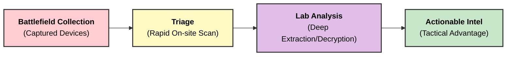
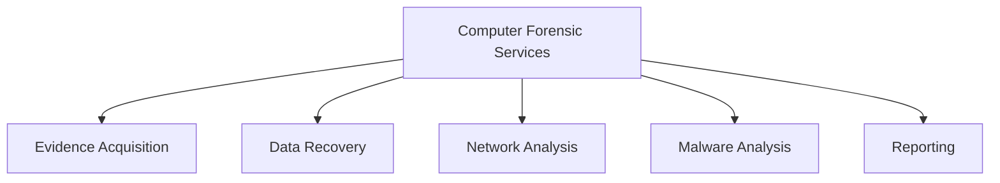

### **Q: Explain in brief computer forensic services. Write the applications of digital forensics in military.**

#### **1. Computer Forensic Services**

Computer forensic services encompass the professional activities performed by forensic experts to identify, preserve, analyze, and present digital evidence. These services are utilized by law enforcement, legal firms, and corporations.

**Key Services Include:**

  * **Data Acquisition & Preservation:** Creating exact, bit-for-bit copies (**Forensic Images**) of hard drives, mobile devices, and cloud storage to ensure evidence integrity.
  * **Data Recovery:** Retrieving intentionaly deleted, formatted, or corrupted files using specialized carving techniques.
  * **Forensic Analysis:** examining the file system, registry, and artifacts to reconstruct user activities and timelines.
  * **Malware Analysis:** Reverse-engineering malicious software to understand its origin, payload, and impact.
  * **Expert Witness Testimony:** Presenting complex technical findings in a court of law in a simplified manner.
  * **Mobile & Network Forensics:** Extracting data from smartphones (call logs, GPS) and analyzing network traffic (packet capture) for intrusion detection.

-----

#### **2. Applications of Digital Forensics in Military**

In the military sector, digital forensics is often referred to as **DOMEX (Document and Media Exploitation)**. It plays a critical role in national security and information warfare.

**Key Applications:**

  * **Intelligence Gathering (Intel):**
      * Extracting data from captured enemy devices (laptops, phones, drones) to reveal future plans, troop locations, or communication networks.
  * **Counter-Terrorism:**
      * Analyzing encrypted communications and financial logs to trace funding sources and recruitment networks of terrorist organizations.
  * **Cyber Warfare & Defense:**
      * Investigating state-sponsored cyberattacks to determine the **Attribution** (source) and methodology of the attack.
  * **Insider Threat Detection:**
      * Monitoring internal networks to detect espionage or unauthorized leakage of classified military secrets.
  * **Battlefield Forensics:**
      * Rapid on-site analysis of digital media found in combat zones to gain immediate tactical advantages (Real-time Intel).

-----

#### **3. Diagram: Military Forensic Workflow (DOMEX)**

-----

#### **4. Key Technical Keywords**

  * **DOMEX (Document and Media Exploitation):** The processing of captured physical documents and digital media to generate intelligence.
  * **Triage:** The process of quickly prioritizing evidence to determine which devices contain the most critical information.
  * **Attribution:** The science of identifying the specific actor or group responsible for a cyber intrusion.
  * **Cryptanalysis:** The study of analyzing information systems to breach cryptographic security systems (cracking encryption).
---
# **Computer Forensic Services & Applications of Digital Forensics in Military**

---

# **1️⃣ Computer Forensic Services (Brief Explanation)**

## **A. Evidence Acquisition**

* Creation of **bit-stream forensic images** of storage media.
* Use of **write-blockers** to prevent alteration.
* Hash generation (**MD5/SHA-1**) for authenticity.

## **B. Data Recovery**

* Retrieval of **deleted, hidden, encrypted, or corrupted** files.
* Techniques like **file carving**, slack space analysis.

## **C. Log and Timeline Analysis**

* Examination of **system logs, event logs, access logs**.
* Reconstruction of **chronological sequences** of user/system actions.

## **D. Network Forensics**

* Monitoring and analyzing **packet flows**.
* Detection of **intrusion attempts, data exfiltration, malware traffic**.

## **E. Malware Examination**

* Reverse engineering of **malware, trojans, ransomware**.
* Analyzing payload, persistence, and infection method.

## **F. Mobile Forensics**

* Extraction of **SMS, GPS data, call logs, app artifacts** from smartphones.

## **G. Reporting & Expert Testimony**

* Preparation of **legally admissible forensic reports**.
* Presentation of findings in **court of law**.

---

# **2️⃣ Small Diagram – Computer Forensic Services**

---

# **3️⃣ Applications of Digital Forensics in Military**

## **A. Cyber Warfare Defense**

* Detecting and analyzing **nation-state attacks**.
* Investigating **APT (Advanced Persistent Threat)** operations.

## **B. Counter-Espionage**

* Identifying **spyware, keyloggers, backdoors** implanted by foreign adversaries.
* Protecting sensitive defense data and communication channels.

## **C. Incident Response in Defense Networks**

* Real-time monitoring of **mission-critical systems**.
* Forensic triage of compromised units.

## **D. Malware & Zero-Day Analysis**

* Reverse engineering **sophisticated military-grade malware**.
* Studying exploits used in **cyber espionage and sabotage**.

## **E. Battlefield Digital Evidence**

* Analyzing data from **captured devices, drones, radios, GPS units**.
* Extraction of intelligence for operational planning.

## **F. Secure Communication & Integrity Verification**

* Verification of **data authenticity** using hashing and cryptographic checks.
* Preventing manipulation of **military intelligence files**.

---

# **Summary**

Computer forensic services include **evidence acquisition, data recovery, log analysis, network forensics, malware analysis, mobile forensics, and reporting**.
In the **military sector**, digital forensics supports **cyber defense, counter-espionage, incident response, malware analysis, battlefield intelligence**, and ensures **data integrity** in sensitive operations.