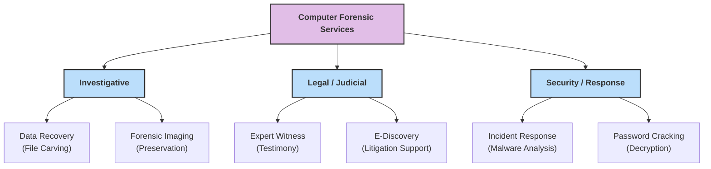
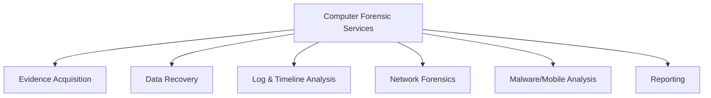

### **Q: Explain in detail different computer forensic services.**

#### **1. Overview**

Computer forensic services encompass a range of specialized technical activities provided by forensic experts to law enforcement, corporations, and legal firms. These services aim to identify, preserve, analyze, and present digital evidence in a manner that is **legally admissible**.

-----

#### **2. Key Computer Forensic Services**

**1. Data Acquisition & Preservation**

  * **Description:** The foundational service where evidence is secured from the source without alteration.
  * **Technical Detail:**
      * Experts use **Write Blockers** to ensure read-only access.
      * Creation of a **Bit-Stream Image** (e.g., `.E01` file), which is a sector-by-sector clone of the drive, including hidden and deleted sectors.
      * **Hashing** (MD5/SHA-256) is performed to verify the integrity of the image against the original source.
  * **Goal:** To maintain the **Chain of Custody** and prevent spoliation of evidence.

**2. Data Recovery & Restoration**

  * **Description:** Retrieving data that has been intentionally deleted, formatted, or damaged physically/logically.
  * **Technical Detail:**
      * **File Carving:** Recovering files from "Unallocated Space" by recognizing file headers and footers, even if the file system (FAT/NTFS) table is corrupted.
      * **Physical Recovery:** Repairing damaged controller boards or drive heads in a Clean Room environment to extract raw data.
  * **Goal:** To recover critical artifacts like deleted emails, documents, or logs.

**3. Expert Witness & Litigation Support**

  * **Description:** Providing professional testimony in court to explain technical findings to a judge or jury.
  * **Technical Detail:**
      * Translating complex technical jargon (e.g., "Hex Dump," "IP Header") into plain language.
      * Defending the **methodology** used during the investigation against cross-examination.
      * Providing an objective, unbiased opinion based strictly on the binary evidence.
  * **Goal:** To validate the evidence and assist the court in understanding the technical facts.

**4. Incident Response (IR) & Malware Analysis**

  * **Description:** Rapid response services for active security breaches (e.g., Ransomware, hacking).
  * **Technical Detail:**
      * **Root Cause Analysis (RCA):** Determining the "Patient Zero" or entry point of the attack.
      * **Reverse Engineering:** Disassembling malware code to understand its behavior, payload, and communication channels (C2 servers).
      * **Volatile Data Collection:** Capturing RAM and active network connections before the system is powered off.
  * **Goal:** To contain the threat, mitigate damage, and prevent future recurrence.

**5. E-Discovery (Electronic Discovery)**

  * **Description:** The large-scale processing of electronic data for civil litigation or regulatory audits.
  * **Technical Detail:**
      * Ingesting terabytes of unstructured data (emails, chats, PDFs).
      * Using **Keyword Search** and **Deduplication** (hashing) to filter out irrelevant files.
      * **Optical Character Recognition (OCR)** to make scanned documents searchable.
  * **Goal:** To produce relevant documents for legal review efficiently and cost-effectively.

-----

#### **3. Diagram: Taxonomy of Forensic Services**

-----

#### **4. Key Technical Keywords**

  * **Spoliation:** The intentional, reckless, or negligent withholding, hiding, altering, fabricating, or destroying of evidence relevant to a legal proceeding.
  * **Bit-Stream Image:** An exact bit-for-bit copy of a storage media, including slack space and unallocated space.
  * **File Carving:** The process of reassembling computer files from fragments in the absence of filesystem metadata.
  * **Chain of Custody:** The documentation trail that accounts for the custody, control, transfer, analysis, and disposition of physical and electronic evidence.
---
# **Different Computer Forensic Services (Explained in Detail)**

---

# **1️⃣ Overview**

Computer forensic services involve **systematic processes and specialized techniques** used to identify, preserve, analyze, and present **digital evidence** for legal, corporate, or investigative purposes.

---

# **2️⃣ Detailed Computer Forensic Services**

---

## **A. Evidence Acquisition & Preservation**

### **Key Technical Activities**

* Creation of **bit-stream forensic images** of storage devices.
* Use of **hardware write-blockers** to prevent data modification.
* Generation of **hash values (MD5/SHA-1/SHA-256)** to maintain authenticity.
* Documentation of **chain of custody** for legal acceptance.

### **Importance**

* Ensures the **original evidence remains unchanged** and is admissible in court.

---

## **B. Data Recovery & File Carving**

### **Key Technical Activities**

* Recovery of **deleted, formatted, hidden, fragmented** files.
* Use of file carving techniques to recover data from **unallocated and slack space**.
* Handling encrypted or partially corrupted files.

### **Importance**

* Helps retrieve crucial evidence that offenders may have attempted to erase.

---

## **C. Log Analysis & Timeline Reconstruction**

### **Key Technical Activities**

* Examination of **system logs, security logs, event logs, application logs**.
* Correlation of timestamps to reconstruct **chronological activity sequences**.
* Detection of login attempts, file access patterns, and suspicious behavior.

### **Importance**

* Enables investigators to understand **how, when, and by whom** actions were performed.

---

## **D. Network Forensics**

### **Key Technical Activities**

* Real-time or offline **packet capture** and protocol analysis (TCP/UDP/HTTP).
* Examination of firewall, IDS/IPS, router logs.
* Detection of **intrusions, port scans, malware traffic**, and data exfiltration.

### **Importance**

* Essential for investigating **hacking attempts, unauthorized access**, and network attacks.

---

## **E. Malware Analysis**

### **Key Technical Activities**

* Static and dynamic analysis of malware samples.
* Identifying **payloads, infection vectors, persistence techniques**.
* Reverse engineering using tools like IDA Pro, Ghidra.

### **Importance**

* Helps understand malicious code behavior and design countermeasures.

---

## **F. Memory (RAM) Forensics**

### **Key Technical Activities**

* Extraction of volatile data: **running processes, network connections, registry hives, encryption keys**.
* Using frameworks like **Volatility** or **Rekall**.
* Detection of **rootkits, kernel-level malware**.

### **Importance**

* Provides information not available on disk, especially in **live attacks**.

---

## **G. Mobile Device Forensics**

### **Key Technical Activities**

* Extraction of **SMS, call logs, GPS history, app artifacts, deleted media**.
* Support for Android/iOS devices using tools like Cellebrite.
* Cloud backup acquisition (iCloud, Google Drive).

### **Importance**

* Critical in cases involving **communication evidence, location tracking**, and cyberstalking.

---

## **H. Reporting & Court Presentation**

### **Key Technical Activities**

* Preparation of **structured forensic reports** with evidence screenshots, logs, and conclusions.
* Maintaining **legal standards** for admissibility.
* Expert testimony explaining technical findings in simple terms.

### **Importance**

* Ensures forensic results are **clearly communicated** and legally defensible.

---

# **3️⃣ Small Diagram – Computer Forensic Services**

---

# **4️⃣ Summary**

Computer forensic services include **evidence acquisition, data recovery, log analysis, network forensics, malware analysis, memory forensics, mobile forensics, and reporting**. These systematically help investigators extract, preserve, and present **digital evidence** in a legally acceptable and technically sound manner.
